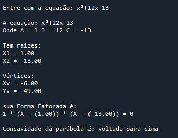

# Bhaskara 🧮

Programa em python que recebe uma equação 2° grau completa e retorna as raízes, os vértices, a forma fatorada e concavidade da parábola.

## Exemplo de saída 📁

 

 

## Ferramentas usadas 🔧

 

## 💻 Desenvolvedora:

- 👩🏻‍💻 RAFAELA BEZERRA DE FIGUEIREDO. 
